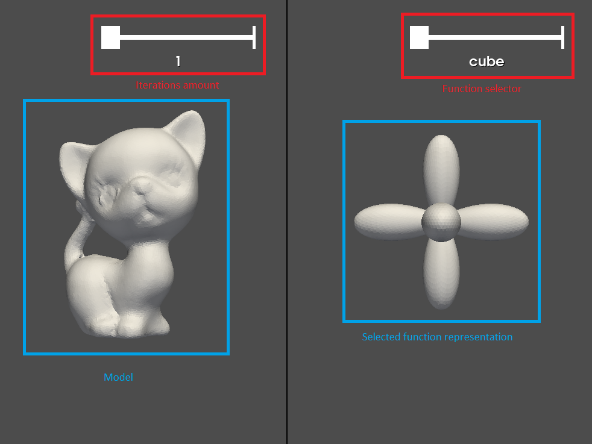

# Gauss Stylization

This is a python implementation for the paper "Gauss Stylization: Interactive Artistic Mesh Modeling
based on Preferred Surface Normals" by M. Kohlbrenner, U. Finnendahl, T. Djuren, M. Alexa
See the [project page](https://cybertron.cg.tu-berlin.de/projects/gaussStylization/) for more information.

## Running the code

### Setup

We used conda to manage the python environment.

You can install conda from [here](https://docs.conda.io/projects/conda/en/stable/user-guide/install/index.html) (We recommend using miniconda as it is the lighter way to get the conda package manager).

To install the required packages, run

```sh
conda config --add channels conda-forge                                                                                                                                                                                 ─╯
conda config --set channel_priority strict
conda env create -f environment.yml
```

### Running the code

In a terminal, activate the conda environment by running

```sh
conda activate gauss_stylization
```

And then on the same terminal run

```sh
python app.py
```

Run help to see the available options

```sh
python app.py --help
```

```
usage: gauss_stylization [-h] [--model MODEL] [--sigma SIGMA] [--mu MU] [--lambda_value LAMBDA_VALUE] [--caxiscontrib CAXISCONTRIB] [--admm_iterations ADMM_ITERATIONS]

options:
  -h, --help            show this help message and exit
  --model MODEL         model to stylize (default: cat_s3.off)
  --sigma SIGMA         sigma value for function (default: 8)
  --mu MU               mu parameter (default: 1)
  --lambda_value LAMBDA_VALUE
                        lambda parameter (default: 4)
  --caxiscontrib CAXISCONTRIB
                        Axis contribution in semi-discrete normals (discrete normals contribution when using semi-discrete normals) (default: 0.5)
  --admm_iterations ADMM_ITERATIONS
                        admm iterations to do per gauss stylization update (default: 1)
```

## User interface


The GUI is divided into 2 sections:

1. Model section
2. Stylization section

### Model section

The model section contains the model to stylize and an iteration amount slider.\
The iteration amount slider controls the number of iterations of stylization to make when we stylize the model.\
The presented model is the model after the stylization iterations (updates after each iteration).

### Stylization section

The stylization section contains the representation of the stylization function and a function selector slider.\
The representation will change according to the selected function and the startup parameters.

### Controls

You can control the model and the function representation camera using the following controls:

- Use the mouse to rotate (click and drag).
- Use the mouse wheel to zoom in and out.
- Use the right mouse button to pan (click and drag).
- Press the 'r' key to reset the camera.

You can control the stylization using the following controls:

- Press the 'space' key to start stylizing the model (will make the selected number of stylization iterations from the slider).
- Press the 'z' key to reset the stylization to the initial model.

### Notes

Timing of the stylization will be printed to the terminal.

## Adding functions

You can add functions to the stylization by adding them to the "functions.json" file.\
The file contains a list of functions, each function has the following fields:

- name: The name of the function.
- discrete normals: A list of discrete normals to use for the function.
- semi-discrete normals: A list of semi-discrete normals to use for the function (the opening angle).
- semi-discrete normals axes: A list of axes to use for the semi-discrete normals.

For example:

```json
{
  "name": "cylinder x",
  "discrete_normals": [
    [1, 0, 0],
    [-1, 0, 0]
  ],
  "semi_discrete_normals": [0],
  "semi_discrete_normals_axes": [[1, 0, 0]]
}
```
